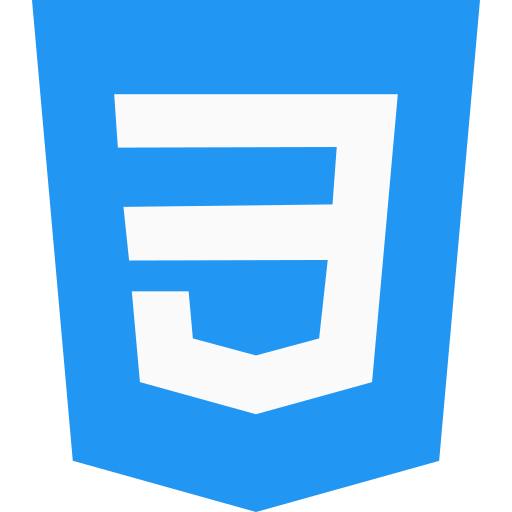
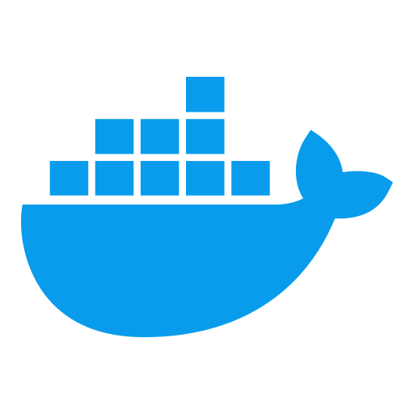
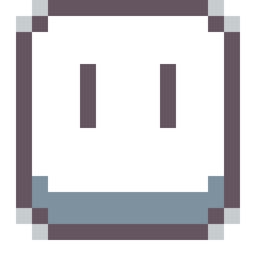

### Hi, I'm Can 

#### I'm a Computer Engineer

- 🌱 I’m currently learning frontend development and jamstack
- ⚡ I try to draw pixel art
- ❤️ I love tiny houses

### Languages and technologies I have worked with

[][html]
[][css]
[][javascript]
[][typescript]
[][dart]

[][nodejs]
[][nestjs]
[][expressjs]
[][vuejs]
[][nuxtjs]
[][tailwind]
[][bootstrap]
[][sass]
[][flutter]

[][postgre]
[][mongo]

[][vscode]
[][git]
[][sourcetree]
[][github]
[][gitlab]
[][bitbucket]
[][trello]
[][docker]
[][aseprite]

### Connect with me

[][linkedin]

### Stats

 

[linkedin]: https://linkedin.com/in/candeve
[discord]: https://discord.gg/ER7Cc4VSWQ
[dart]: https://dart.dev
[java]: https://www.java.com
[javascript]: https://www.javascript.com
[typescript]: https://www.typescriptlang.org
[html]: https://www.w3schools.com/html/
[css]: https://www.w3schools.com/css/
[expressjs]: https://expressjs.com/
[flutter]: https://flutter.dev
[nestjs]: https://nestjs.com
[nodejs]: https://nodejs.org
[tailwind]: https://tailwindcss.com/
[bootstrap]: https://getbootstrap.com
[vuejs]: https://vuejs.org
[nuxtjs]: https://nuxtjs.org/
[springboot]: https://spring.io
[sass]: https://sass-lang.com/
[postgre]: https://www.postgresql.org
[mongo]: https://www.mongodb.com
[vscode]: https://code.visualstudio.com
[git]: https://git-scm.com
[sourcetree]: https://www.sourcetreeapp.com
[github]: https://github.com
[gitlab]: https://about.gitlab.com
[bitbucket]: https://bitbucket.org
[aseprite]: https://www.aseprite.org
[docker]: https://www.docker.com
[trello]: https://trello.com
[graphql]: https://graphql.org
